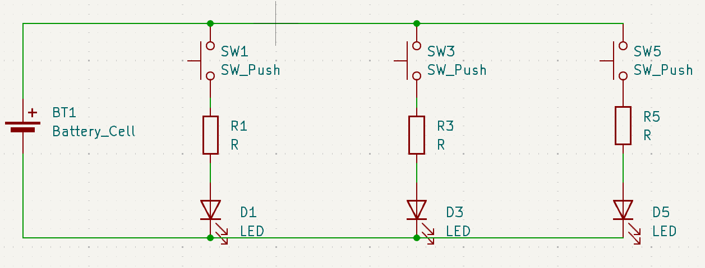
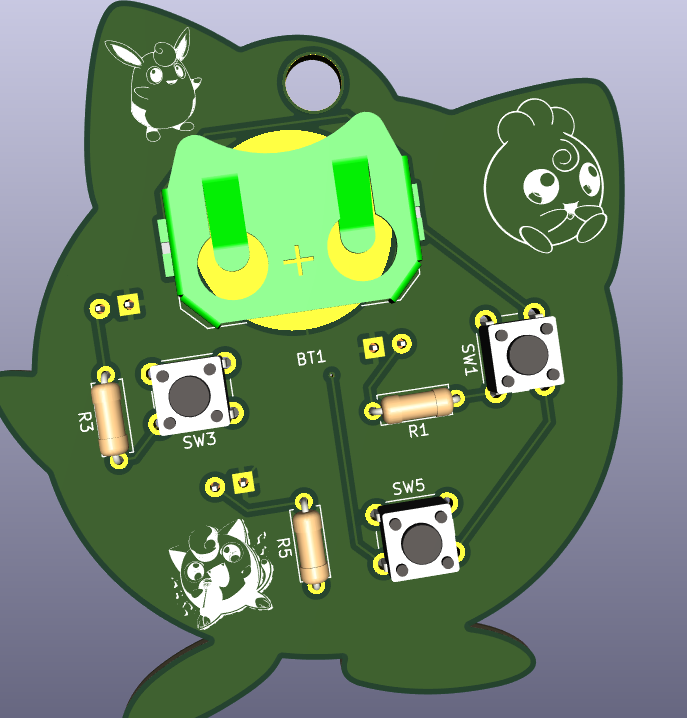

# Jigglupuff_Keychain
Ever seen a keychain as charming that'll make you drowsy!! A jigglypuff keychain

## Schematic

## PCB

## Features
- Shape of jigglypuff can be used as a decorative item
- Circular hole at the top for attaching it to a keyring or lanyard
- LEDs attached at pupils and mouth for decoration
- Can glow at dark places using batteries

## How to build
Can be built at Kicad you just need to download the outline and image from internet.

## BOM
- 1 Battery Holder
- 3 220ohm Resistor
- 3 push button
- 3 5mm LED 
- PCB

# Slack Username

Made by `@shwetashaw006` on Slack 😁😁

Built for [Hack club solder](https://github.com/hackclub/solder)
